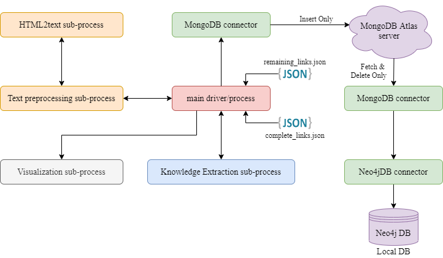

## What’s In This Document
- [Introduction](./README.md#introduction)
- [Setup Instructions](./README.md#setup-instructions)
- [Getting Started](./README.md#getting-started)
- [**Abstract Idea & Problem**](#abstract-idea-&-problem)
- [**Trade-off between RAM size & DB access time with the solution**](#trade-off-between-RAM-size-&-DB-access-time-with-the-solution)
- [**Implementation**](#implementation)
- [**Future Development**](#future-development)
- [**Results**](#results)
- [License](./README.md#license)
- [Acknowledgements](./README.md#acknowledgements)


<h4 align="center">
If you want to setup & execute this repo the check this <a href="./README.md">README file</a>.
</h4>


## Abstract Idea & Problem
First & foremost, the main process works in the form of batches having JSON-like schema (an example is given in the [implementation](#implementation) section) includes the Wikipedia page links. These pages are scraped, pre-processed & knowledge is extracted for them. After completing, the extracted knowledge stored in the current batch is transferred to the MongoDB Atlas server for temporary persistence (the permanent storage is the Neo4j DB). Here MongoDB is only used as the helper DB because the complete process is running on the Google Colab & I didn't want to host the Neo4j DB so, I made use of the free tier of MongoDB Atlas server 😅.

### Problem with RAM memory
You can try the larger model (as ```python -m spacy download en_core_web_lg```) but, the code doesn't work even with 12GB of RAM on Google Colab due to pages having massive content. <br />
(For example, when I ran the code on google colab it killed the process when it reached [**this**](https://en.wikipedia.org/wiki/Vladimir_Putin) Wikipedia page)

> **Why the code requires 12+ GB of RAM?** (The possible reason could be)
>
> When a large language model is used, it allocates too much memory on the RAM & at the same time the code is running the batch process i.e it takes 5 Wikipedia links & finds the knowledge representation & all this data is stored in the RAM, after the batch completion the data is transferred to the MongoDB Atlas server.


## Trade-off between RAM size & DB access time with the solution
#### RAM size vs DB access time
As you saw in the previous section that the batch is collected first & is stored in MongoDB, but its also possible to extract the knowledge from a link & store the data directly to MongoDB but, this is a time-consuming process as we, accessing the DB for each & every link, so I used the batch insert approach. But the problem with the batched approach is the limited amount of RAM as I am storing the massive extracted data on RAM, it is possible the knowledge extraction sub-process is not getting sufficient space on RAM ```(for some pages, the extracted knowledge is massive & for some it is tiny)```.

#### Trade-off Solution
As I got to know that the nature of the knowledge found on the pages can have massive or tiny. So to solve this problem, I can keep a track of how many pairs of entity (knowledge) are stores in the batch & if it exceeds a certain threshold, then I can insert them to the DB & delete from RAM.

## Implementation
#### Batch example
You will find that in the code its says mini-batch, but batch & mini-batch both are the same and, I will update the code soon to avoid confusion.
```json
batch = [ ..., 
    {
        "doc_name": "Albert Einstein",
        "wiki_url": "https://en.wikipedia.org/wiki/Albert_Einstein",
        "done": True,
        "entity_list": [ ...,
            {
                "subject": "Albert einstein",
                "relation": "produced",
                "object": "E = mc2",
                "subj_type": "PERSON",
                "obj_type": "NOUN_CHUNK"
            },
            ...
        ]
    }, 
    ...
]
```

#### Architectural flow
<p align="center">
    
</p>

##### HTML2text sub-process:
> ##### Input: Wikipedia page URL
> ##### Output: Textual content from that HTML page.
> ##### Processing: Fetches the HTML page using the URL and removes unwanted HTML blocks (such as header, footer, tables, images, etc).

##### Text Preprocessing sub-process:
> ##### Input: Textual content generated by the HTML2text sub-process.
> ##### Output: Preprocessed textual data.
> ##### Processing: Applies some of the common text preprocessing techniques.

##### Knowledge Extraction sub-process:
> ##### Input: Cleaned document (preprocessed html2text version).
> ##### Output: List of entities (subject, relation, object) found in the document.
> ##### Processing: Using spaCy's compiled language model named entities recognition (NER), and extraction is done. Issues related to referencing are resolved with the help of the neuralcoref module.

##### Visualization sub-process:
> ##### Input: Entity list generated by a knowledge extraction sub-process.
> ##### Output: None
> ##### Processing: Converts these entities to a graph with subject and object as nodes and relationships between them as an edge in the graph between these nodes.

##### MongoDB Connector:
> ---- For Insertion ----
> ##### Input: Batch containing entity list for each URL.
> ##### Output: None
> ##### Processing: Insert the inputs as a list of documents to MongoDB server (hosted on Atlas).
> ---- For fetching ----
> ##### Input: None
> ##### Output: List of documents
> ##### Processing: At regular interval of time documents can be fetched from MongoDB server and send to Neo4jDB Connector.

##### Neo4jDB Connector:
> ---- For Insertion ----
> ##### Input: Documents from MongoDB connector
> ##### Output: None
> ##### Processing: Insert entities to the Neo4j local DB as a Subject node, Object node, and the relation between them.

##### Main process:
> ##### Input: Batch from the remaining link JSON file.
> ##### Output: None
> ##### Processing: Links from the batch are sent to the Text Preprocessing sub-process and gets the cleaned version of html. Now this textual data is send to the Knowledge Extraction sub-process and gets list of entities. After all the links from the batch are done the data stored in the batch is passed to MongoDB Connector.


## Future Development
- Improvement in the script to incorporate the mentioned solution for the trade-off.
- Optimizing the knowledge extraction script to accept useful information only.
- Currently, the statements having multiple subjects or objects are neglected. So implementing an efficient way to extract the knowledge from those statements which contain more than one subject or object.

## Results
<p align="center">
    
    <br />
    The above image shows the extracted knowledge for "Albert einstein" 
</p>